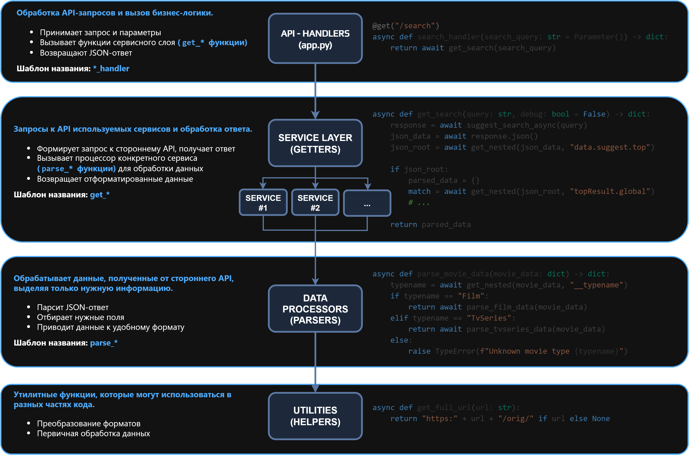
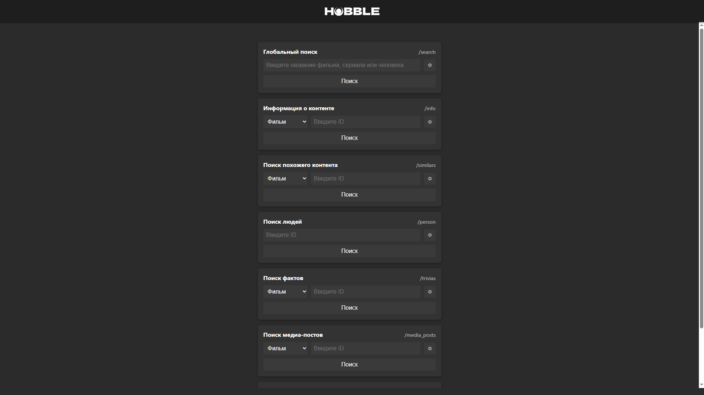
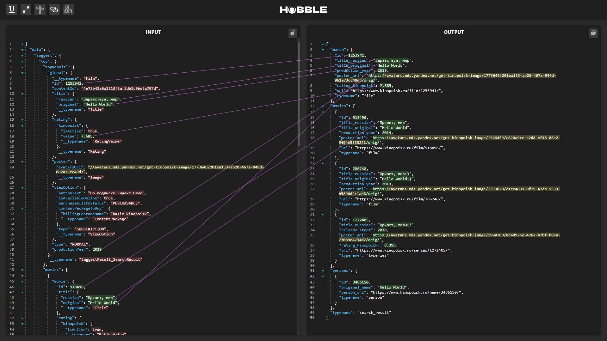

# **KINOHUBBLE - API для агрегации и кэширования данных о фильмах, сериалах, аниме и людях кинематографа.**

<div style="text-align: center;">
  
</div>

> [!WARNING]
> Данный инструмент разработан и опубликован исключительно в образовательных целях и предназначен для личного использования. Он не является официальным инструментом и не нарушает условия использования сторонних сервисов, с которыми взаимодействует.
> Автор не несёт ответственности за последствия его использования, включая, но не ограничиваясь, возможными блокировками, ограничениями доступа или юридическими последствиями.
> Ответственность за соблюдение условий использования сторонних сервисов, с которыми взаимодействует инструмент, полностью лежит на пользователе.

## 📄 **Описание запросов**

-   **`/search` (GET)** - запрос для глобального поиска, объединяет в себе поиск медиа-контента (фильмы, сериалы) и людей кино (по фио). Принимает на вход строку поиска. Использует поиск сервиса КиноПоиск, что позволяет искать контент или людей по контексту и описанию.
-   **`/info` (GET)** - запрос для получения подробной информации о медиа-контенте. Принимает на вход тип медиа-контента `content_type`, (`film` или `tvseries`) и его `id`.
-   **`/similars` (GET)** - запрос для получения схожего контента. Принимает на вход тип медиа-контента `content_type`, (`film` или `tvseries`) и его `id`.
-   **`/person` (GET)** - запрос для получения информации о человеке кино. Принимает на вход `id` человека.
-   **`/trivias` (GET)** - запрос для получения фактов о медиа-контенте. Принимает на вход тип медиа-контента `content_type`, (`film` или `tvseries`) и его `id`.
-   **`/media_posts` (GET)** - запрос для получения постов и статей о медиа-контенте. Принимает на вход тип медиа-контента `content_type`, (`film` или `tvseries`) и его `id`.
-   **`/series_dates` (GET)** - запрос для получения дат выхода серий сериала. Принимает на вход

## **Источники данных**

Для получения данных о медиа-контенте и людях кино, все методы HUBBLE, кроме `/series_dates` использует библиотеку **[kinopapi](https://github.com/cloudsucker/kinopapi.git)**.

Для получения дат выхода серий с сервиса toramp, были написаны отдельные запросы внутри HUBBLE.

## **🚀 Установка**

### 1. **Клонирование репозитория:**

```bash
git clone https://github.com/cloudsucker/kinohubble.git
```

**Перейдите в директорию проекта:**

Для перехода в созданную при клонировании репозитория директорию используйте:

```bash
cd kinohubble/
```

### 2. **Создание виртуального окружения (опционально):**

_Рекомендуется, если в проекте не создано виртуальнуе окружение._

```bash
python -m venv .venv
```

#### **Активируем виртуальное окружение:**

Windows:

```cmd
.venv\Scripts\activate
```

Linux/macOS:

```bash
source .venv/bin/activate
```

### 3. **Установка зависимостей:**

> [!NOTE]
> В проекте используется собственная библиотека `kinopapi`, не опубликованная на [pypi.org](https://pypi.org/). Она будет автоматически загружена и установлена из [GitHub-репозитория](https://github.com/cloudsucker/kinopapi).

```bash
pip install -r requirements.txt
```

### 🚀 Запуск

```bash
python -m uvicorn app:app --host 127.0.0.1 --port 8080 --reload
```

> [!IMPORTANT]
> На данный момент база данных в проекте была отключена.

## **🧱 Архитектура проекта**

**Проект был разделён на 4 слоя:**

1. **API-HANDLERS LAYER** - слой обработчиков API-запросов;
2. **SERVICE LAYER** - сервисный слой с конкретными реализациями для сторонних API;
3. **DATA PROCESSORS LAYER** - слой форматирования и унифицирования данных;
4. **UTILITIES LAYER** - слой вспомогательных функций.



<div style="text-align: center;">
  <a href="docs/STRUCTURE.md">Подробнее про архитектуру проекта.</a>
</div>

## **📊 Debug GUI**

В режиме `Debug==True` API-Хаб предоставляет удобный интерфейс для тестирования, работы с данными и разработки.

### **Debug Main Page**

На главной странице представлен удобный интерфейс для быстрого ручного и автоматического тестирования запросов.

<div style="text-align: center;">
  
</div>

> [!NOTE]
> Для каждого запроса имеется быстрый автоматический тест с рандомными параметрами.

### **Debug Viewer**

**Debug Viewer** - это шаблонная страница формата `.jinja2` для проверки входных и выходных данных API-Хаба.

<div style="text-align: center;">
  
</div>

## 🔗 **Зависимости**

-   [kinopapi](https://github.com/cloudsucker/kinopapi)>=1.1.0
-   uvicorn==0.34.0
-   litestar==2.14.0

## 📬 **Обратная связь**

**Проект активно развивается, буду рад обратной связи.**

**По всем вопросам:** ferjenkill@gmail.com
